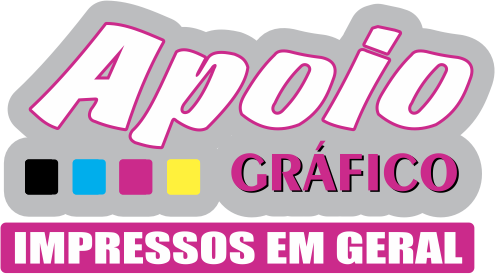
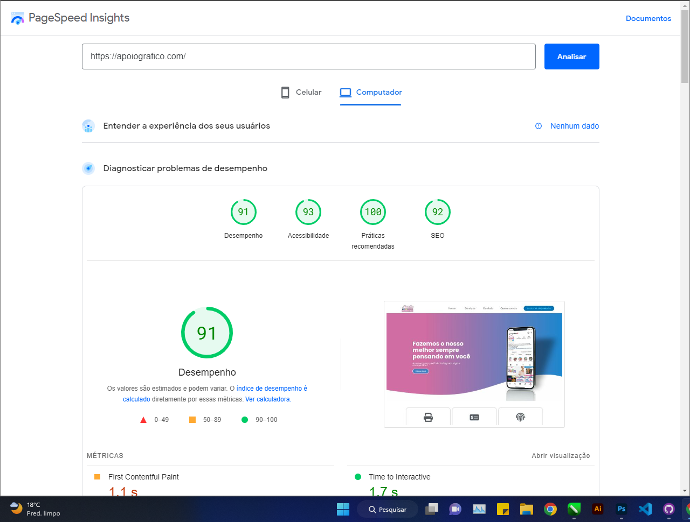
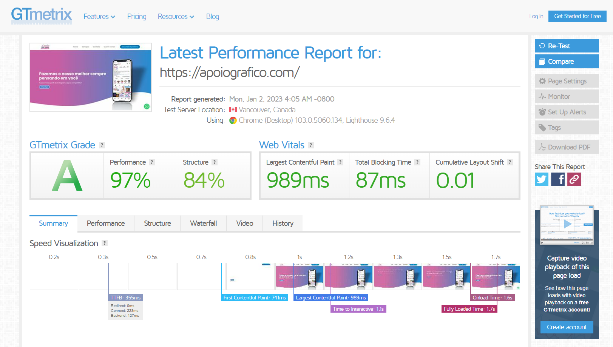
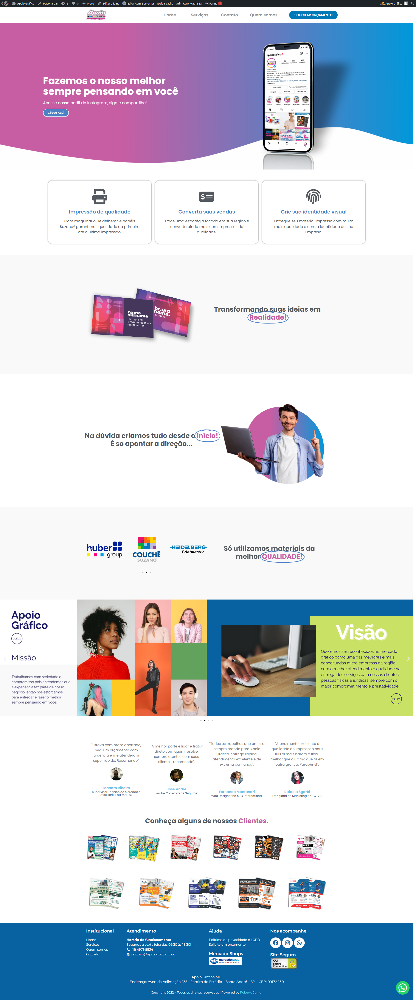
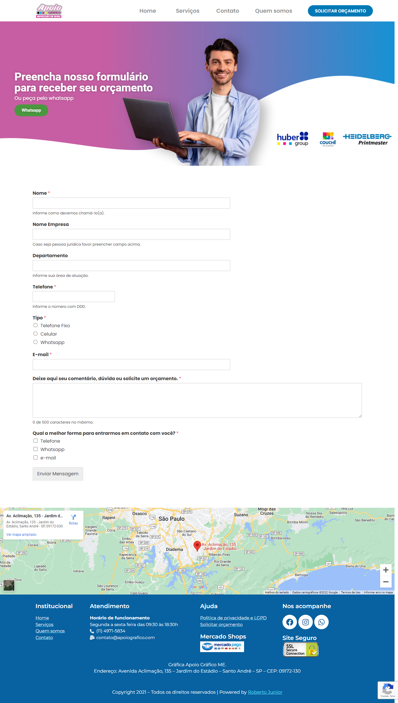
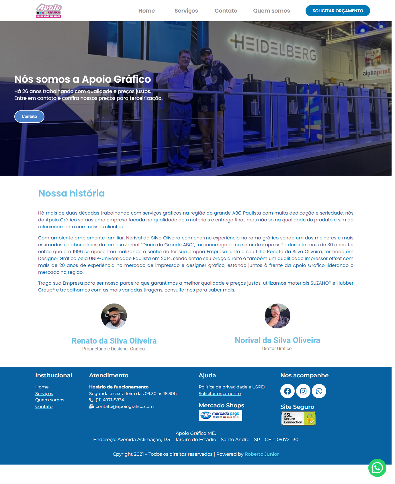

 
 

Meu 1º Projeto pessoal 😁👍

Site criado para empresa de um amigo onde faço Freelance como Designer Gráfico chamada APOIO GRÁFICO, com formulário e Captcha utilizando os seguintes plugins:

 - Updraft plus;
 - Rank math SEO;
 - Really simple SSL;
 - Wp super cache;
 - Ewww image optimizer;
 - Wp cerber seucurity.

TECNOLOGIAS que fazem parte deste projeto 🧑‍🚀🚀:

- Wordpress;
- Elementor;
- HTML5;
- CSS3;
- Photoshop;
- Corel Draw.

Abaixo etapa atual em que o site se encontra, assim que for avançando será atualizado automaticamente.  
Site está atualemnte com 91 de nota de desempenho Desktop no "PageSpeed do Google", conforme imagem abaixo.

Para visualizar a parcial do projeto é só visitar o site <a target="_blank" href="https://www.apoiografico.com"> Clicando aqui!</a>.  
Ou curta as imagens logo abaixo! 😁😍👍👽

Obrigado. (●'◡'●) 

